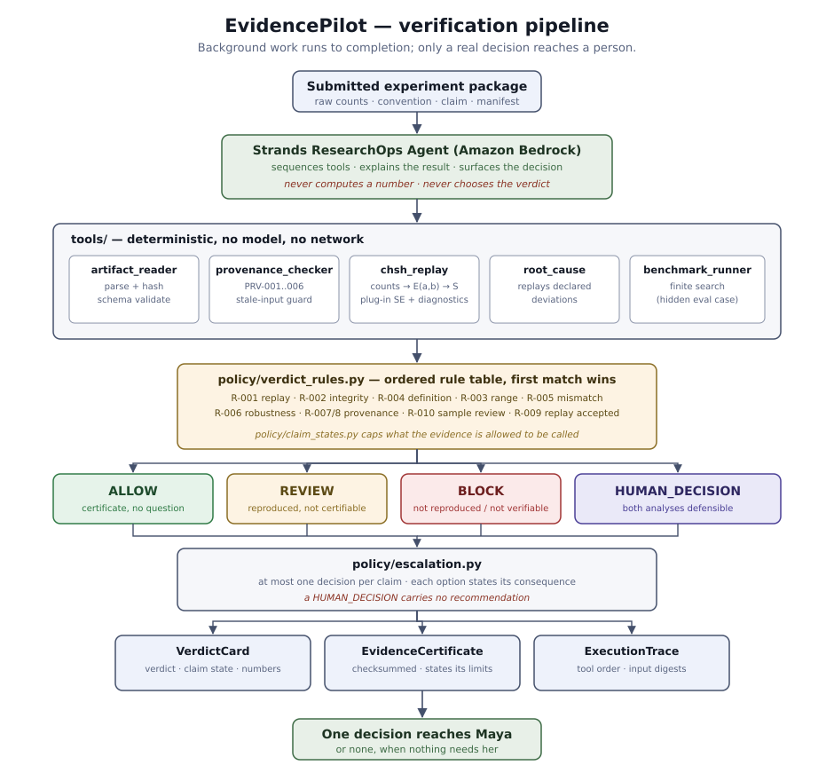

# Architecture



## The shape of the problem

A scientist is handed a claim: *"the latest run violates the CHSH bound,
S = 2.61."* Checking it is not hard, it is tedious — parse the raw counts,
apply the agreed measurement convention, recompute four correlations, combine
them, propagate the uncertainty, and confirm that the artifacts describe the
run they say they describe. Every step is mechanical. None of it is a
judgement call. In the demo scenario the review meeting is forty minutes away;
this is narrative context, not a measured manual-work baseline.

The judgement calls are rare, and they are the only part that needs a person.
EvidencePilot exists to do the first part completely and to be disciplined
about the second.

## Four layers that do not blend

| Layer | Directory | Responsibility |
| --- | --- | --- |
| Agent | `agent/` | Sequence the tools, narrate the outcome |
| Tools | `tools/` | Read artifacts, hash them, compute numbers |
| Policy | `policy/` | Decide verdict, claim state, and escalation |
| Evidence | `evidence/` | Assemble, sign, and refuse to overstate |

The separation is the design. A language model orchestrates and explains;
it never produces a number that lands in a certificate and it never selects a
verdict. Everything a certificate asserts is computed by `tools/` and decided
by the ordered rule table in `policy/verdict_rules.py`, both of which run with
no model, no credentials, and no network.

The practical consequence: `python -m app.main verify …` and the certificate
inside `python -m app.main agent … --json` have the same verdict and numbers.
Model prose is separate, advisory, and not automatically checked for accuracy.
An incomplete model investigation cannot be reported as successful merely because
its prose contains a verdict word. Offline adversarial tests establish the
deterministic boundary; live model behavior requires separate evaluation.

## The pipeline

```
read package ─▶ check provenance ─▶ replay ─▶ explain divergence ─▶ rule table ─▶ escalate
```

1. **`tools/artifact_reader.py`** parses the package and hashes its files.
   Malformed schema inputs can raise validation errors; the hosted POC only
   accepts bundled synthetic cases, not arbitrary uploads.
2. **`tools/provenance_checker.py`** runs `PRV-001` through `PRV-006`: does
   the package match its manifest, does the claim name the dataset actually
   supplied, is the convention registered, was the analysis code submitted,
   is there an environment lock. A critical failure here **stops the run
   before any replay**, because replaying the wrong dataset produces a
   confident answer to the wrong question.
3. **`tools/chsh_replay.py`** recomputes the statistic from raw counts:
   convention correction → `E(a,b)` → `S` → `σ(S)`. The CHSH sign
   combination is read from the convention file, not hardcoded, so a
   convention change is data, not a code change. `tools/chsh_diagnostics.py`
   checks the supported definition and finite-sample warning conditions; it
   does not certify a physical Bell violation. See `docs/chsh_math.md`.
4. **`tools/root_cause.py`** runs only when the replay disagrees. It replays
   a declared, finite set of deviations from the registered convention and
   reports which one — if any — reproduces the submitted number *and* the
   submitted per-pair correlations.
5. **`policy/verdict_rules.py`** applies ten ordered rules, first match wins.
   Definition checks precede algebraic range checks. A reproduced empirical
   value above an expectation bound requires review, not an automatic BLOCK.
6. **`policy/escalation.py`** builds at most one decision, with the
   consequence of each option spelled out.
7. **`evidence/`** issues an integrity-checksummed certificate carrying the verdict, the
   inputs, the execution trace, and an explicit list of what was *not*
   established.

## Why the root-cause step matters

"The numbers disagree" is a weak finding: it tells the scientist there is a
problem and leaves the work with them. "The registered channel correction for
BLK-02 was declared but not applied, and dropping it reproduces your 2.61
exactly" is a finding they can act on in one minute.

The search space is deliberately small and declared up front — dropped channel
corrections, flipped combination signs, silent post-selection. A deviation is
only accepted as *the* root cause when it reproduces both the claimed
statistic and the claimed per-pair correlations, because different mistakes
can land on the same `S`. In the shipped hero case two deviations reach
S = 2.6125 and only one also reproduces the reported correlations; when the
per-pair numbers are withheld, the agent reports the ambiguity rather than
guessing. That behaviour is pinned by
`tests/unit/test_root_cause.py`.

## Where the model actually helps

Not in the arithmetic. The intended model contributions are narrow:

- requesting the next permitted tool for a host-selected package;
- writing the explanation a hurried human reads at 16:17;
- noticing when the tool output does not answer the question that was asked.

`agent/prompts.py` states the rules. `policy/investigation.py` defines legal
actions and `agent/investigation.py` accumulates actual tool results.
`agent/poc_narrator.py` supplies five no-argument tools bound to one package;
the model cannot choose a path or pass a replacement number or verdict.
Both the POC and operator CLI use this engine. The final tool rederives the card
from collected evidence and requires agreement with the model-independent baseline.
Both runs share code, so this is execution consistency, not an independent
scientific oracle. Hand-computed test cases check the mathematical assumptions.

The baseline trace, this investigation's verification trace, and the agent's
action trace remain distinct. Human attention is not a recorded human decision.
See [Stateful investigation](investigation_workflow.md) for completion semantics,
bounds, test coverage, and limitations. These design intentions are not a measured
claim of model usefulness, planning accuracy, or time saved.

## Deployment

`infra/agentcore/` and `infra/aws/` hold the Bedrock AgentCore notes and the
runtime configuration. Deployment is deliberately not on the critical path:
the verification core has no AWS dependency, so CI stays fast, free, and
green without credentials, and live Bedrock calls run from a manually
triggered workflow.
